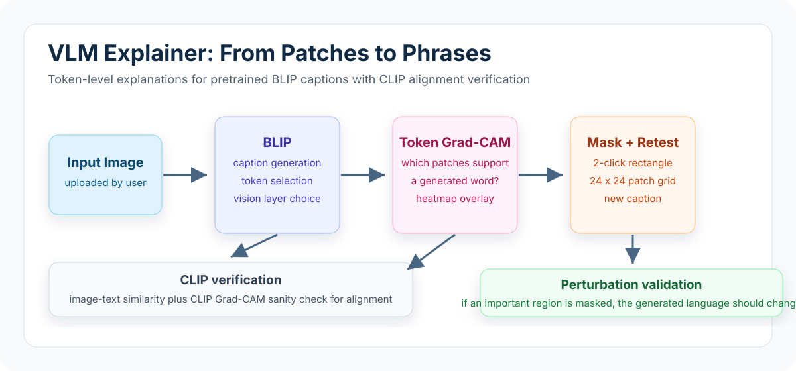

# VLM Explainer: From Patches to Phrases

VLM Explainer is an interactive Streamlit application for interpreting why pretrained vision-language models generate specific caption words for an image.

The project uses BLIP for image captioning and token-level visual explanations, then uses CLIP as a separate image-text alignment check. It focuses on model interpretation and analysis, not training a new VLM from scratch.



## Core Idea

A vision-language model can generate a fluent caption such as `a family walking along the beach with their dog`, but the model's reasoning is usually opaque. This app makes the captioning process more inspectable by connecting generated words back to visual regions and testing whether removing those regions changes the caption.

## Features

- Generate image captions with `Salesforce/blip-image-captioning-base`.
- Select individual caption tokens and compute token-level BLIP Grad-CAM heatmaps.
- Choose shallow-to-deep BLIP vision layers to inspect representation changes.
- Map pixels to BLIP's patch grid for region-level analysis.
- Manually select image regions with a 2-click rectangle interaction.
- Mask selected regions and regenerate captions to test causal behavior.
- Compute CLIP image-text similarity for the generated or edited caption.
- Generate CLIP Grad-CAM heatmaps as an alignment sanity check.
- Build a BLIP layer-evolution video showing how heatmaps change across layers.

## Example Explanation Workflow

1. Upload an image.
2. BLIP generates a caption.
3. Select a generated token such as `dog`.
4. Generate a BLIP Grad-CAM heatmap for that token.
5. Check whether the heatmap activates over the dog region.
6. Mask the dog region using the rectangle selector.
7. Regenerate the caption and observe whether the dog concept disappears.
8. Use CLIP similarity and CLIP Grad-CAM to verify image-text alignment.

In the beach example, selecting the token `dog` highlighted the dog region. When that region was masked, BLIP changed the caption to remove the dog concept. Masking the child region similarly changed the generated caption by removing the child/family concept. This shows the heatmaps are not just decorative overlays; the highlighted regions affect the generated language.

## Repository Structure

```text
vlm-explainer/
|-- app.py                     # Streamlit interface and interaction flow
|-- models/
|   |-- blip_explainer.py       # BLIP captioning, token Grad-CAM, vision-layer hooks
|   `-- clip_explainer.py       # CLIP similarity and Grad-CAM verification
|-- utils/
|   |-- image_utils.py          # Heatmap overlays and image utilities
|   |-- patch_utils.py          # Pixel-to-patch mapping and masking helpers
|   `-- video_utils.py          # Layer-evolution frame and MP4 generation
|-- media/
|   `-- vlm-explainer-workflow.svg
|-- requirements.txt
|-- runtime.txt
`-- README.md
```

## Tech Stack

| Area | Tools |
|---|---|
| App UI | Streamlit, streamlit-image-coordinates |
| Captioning model | BLIP, `Salesforce/blip-image-captioning-base` |
| Alignment model | CLIP, `openai/clip-vit-base-patch32` |
| Explainability | Grad-CAM, PyTorch hooks, activations, gradients |
| Image processing | PIL, NumPy, Matplotlib, OpenCV/imageio |
| Model interface | Hugging Face Transformers, PyTorch |

## Setup

```bash
git clone https://github.com/jaypolra/vlm-explainer.git
cd vlm-explainer

python -m venv .venv
source .venv/bin/activate      # macOS/Linux
# .venv\Scripts\activate       # Windows PowerShell

pip install -r requirements.txt
```

Conda alternative:

```bash
conda create -n vlm-explainer python=3.10 -y
conda activate vlm-explainer
pip install -r requirements.txt
```

## Run the App

```bash
streamlit run app.py
```

Upload a JPG or PNG image, select a generated caption token, inspect BLIP Grad-CAM, mask a region, and compare the regenerated caption.

## Design Notes

- **Pretrained models only:** the project analyzes BLIP and CLIP behavior; it does not train a new captioning model.
- **Token-level attribution:** BLIP Grad-CAM targets a selected generated token rather than only explaining the whole caption.
- **Layer selection:** shallow and deep BLIP vision layers can be compared to see how explanations evolve.
- **Perturbation validation:** masking tests whether an important highlighted region actually influences generated language.
- **CLIP as verification:** CLIP provides image-text similarity and a second heatmap view, but BLIP remains the captioning model.

## Limitations

- Grad-CAM is an attribution method, not a complete proof of model reasoning.
- Masking can introduce distribution shift because the edited image may look unnatural to the model.
- Explanations depend on the selected model layer and tokenization behavior.
- Large models may run slowly on CPU-only environments.

## Future Improvements

- Add side-by-side before/after caption comparison with highlighted changed words.
- Support additional VLMs such as BLIP-2, LLaVA, or newer captioning models.
- Add automatic top-region masking from heatmaps instead of manual rectangle selection only.
- Save explanation reports with original image, selected token, heatmap, mask, and regenerated caption.
- Add quantitative perturbation metrics across multiple images and tokens.
